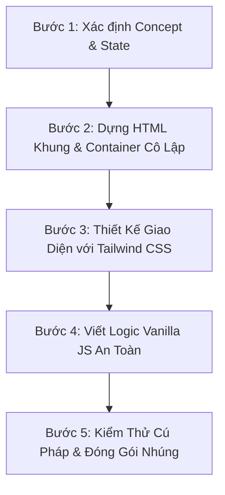

# Kỹ Năng: Tạo Widget Tương Tác Cho Google Blogger (Blogger Widget Creator)

Skill này cung cấp quy trình 5 bước và mã nguồn mẫu để phát triển các công cụ trực quan hóa kiến thức kỹ thuật (Automotive, Embedded Systems, Computer Science, Algorithms) sẵn sàng nhúng trực tiếp vào Google Blogger (Blogspot) hoặc xem độc lập qua GitHub Pages.

---

## 1. Quy Trình Phát Triển 5 Bước (5-Step Workflow)



### Bước 1: Xác Định Concept & Trạng Thái Trực Quan Hóa
- Chọn chủ đề kỹ thuật (Ví dụ: CAN FD Protocol, Memory Layout C++, Scheduler RTOS).
- Chia nhỏ thành 2–3 góc nhìn (Tabs) dễ tiếp cận:
  - *Tab 1*: Cấu trúc / Format dữ liệu trực quan.
  - *Tab 2*: Cơ chế xử lý bên trong Node / Vi điều khiển.
  - *Tab 3*: Giao tiếp trên Bus hoặc quy trình vận hành toàn mạng.

### Bước 2: Dựng Khung HTML Với Root Container Cô Lập
- Bao bọc toàn bộ widget trong một thẻ root `<div>` có ID riêng biệt (Ví dụ: `<div id="canfd-explorer-root" class="w-full font-sans text-slate-800 ...">`).
- Thêm tiêu đề, icon và hệ thống nút chuyển Tab rõ ràng.

### Bước 3: Thiết Kế UI & Styling
- Sử dụng Tailwind CSS qua CDN (`https://cdn.tailwindcss.com`) để đảm bảo nhẹ, đẹp và không xung đột CSS gốc của blog.
- Tận dụng animation `animate-fadeIn` mượt mà khi người dùng bấm đổi tab.
- Thêm class `overflow-x-auto` và `no-scrollbar` cho các bảng hoặc sơ đồ ngang.

### Bước 4: Viết Logic Vanilla JS (Fault-Tolerant)
- Tổ chức dữ liệu dưới dạng cấu trúc Object (`const widgetData = { ... }`).
- Viết các hàm chuyển tab (`switchTab(tabId)`) và cập nhật DOM chi tiết (`renderDetails(id)`).
- **Quy tắc vàng**: Bọc Lucide icon hoặc thư viện ngoài trong `try ... catch` để lỗi mạng không làm đứng tương tác.

### Bước 4b: Pattern Nâng Cao — Data-Driven Accordion (Q&A Widget)
> Áp dụng khi widget có nội dung Q&A nhiều tầng cần maintain lâu dài (ví dụ: CAN FD v1.1.x+).

**Nguyên tắc:** Tách biệt **UI Engine** (render một lần) và **Data Layer** (thêm dần theo thời gian). Không hardcode HTML câu hỏi — chỉ inject vào JS object array.

```javascript
// ✅ ĐÚNG: Data-driven — thêm Q&A chỉ cần thêm object vào array
const qaData = [
    {
        id: "q1",
        question: "Tại sao BRS phải nằm ở Control Field?",
        difficulty: "intermediate",
        tags: ["#Frame", "#BRS"],
        answer: {
            theory: "BRS quyết định tốc độ cho phần sau nó...",
            practice: "MCAL: CanFdBrsEnable = TRUE trong CanControllerConfig...",
            trap: "Nếu BRS=0 thì frame CAN FD có gì khác Classic CAN không?..."
        }
    }
    // Thêm Q&A mới: chỉ thêm object, UI tự render
];

// UI Engine: render một lần, dùng mãi
function renderQACards(data) { /* ... */ }
function filterByTag(tag) { /* ... */ }
function toggleAnswer(id) { /* ... */ }
```

```javascript
// ❌ SAI: Hardcode HTML — khó maintain, phình file khi thêm nhiều Q&A
document.getElementById('qa-section').innerHTML = `
    <div class="card">
        <h3>Tại sao BRS phải nằm ở Control Field?</h3>
        <p>BRS quyết định tốc độ...</p>
    </div>
    <!-- 30 câu hỏi hardcode khác... -->
`;
```

**Khi nào dùng pattern này:** Widget có > 5 Q&A items, hoặc có kế hoạch thêm dần nội dung theo thời gian (Maintenance Plan nhiều sprint).

### Bước 5: Kiểm Thử Cú Pháp & Đóng Gói
- Chạy lệnh kiểm tra cú pháp JavaScript bằng Node.js trước khi lưu:
  ```bash
  node -e "const fs = require('fs'); const html = fs.readFileSync('Tên_File.html', 'utf8'); const js = html.match(/<script>([\s\S]*?)<\/script>/)[1]; new Function(js); console.log('Syntax OK');"
  ```
- Tạo file tài liệu `docs/<tên_chủ_đề>/CURRENT_INFO.md` tương ứng.

---

## 2. Khung Boilerplate Chuẩn (Ready-to-Use Template)

Dưới đây là khung mẫu chuẩn sẵn sàng copy và phát triển widget mới:

```html
<!DOCTYPE html>
<html lang="vi">
<head>
    <meta charset="UTF-8">
    <meta name="viewport" content="width=device-width, initial-scale=1.0">
    <title>Widget Title Here</title>
    <!-- Tailwind CSS CDN -->
    <script src="https://cdn.tailwindcss.com"></script>
    <!-- Lucide Icons CDN -->
    <script src="https://unpkg.com/lucide@latest"></script>
    <style>
        @keyframes fadeIn {
            from { opacity: 0; transform: translateY(8px); }
            to { opacity: 1; transform: translateY(0); }
        }
        .animate-fadeIn { animation: fadeIn 0.35s ease-out forwards; }
        .no-scrollbar::-webkit-scrollbar { display: none; }
        .no-scrollbar { -ms-overflow-style: none; scrollbar-width: none; }
    </style>
</head>
<body class="bg-slate-50 font-sans text-slate-800 antialiased p-4 md:p-8">

    <!-- ROOT CONTAINER DUY NHẤT ĐẢM BẢO CÔ LẬP VỚI THEME BLOGGER -->
    <div id="tech-widget-root" class="max-w-5xl mx-auto">
        
        <!-- Header -->
        <div class="mb-8 text-center">
            <h1 class="text-3xl font-bold text-slate-900 mb-2 flex items-center justify-center gap-2">
                <i data-lucide="layers" class="text-blue-600 w-8 h-8"></i>
                <span>Tên Chủ Đề Widget</span>
            </h1>
            <p class="text-slate-600 text-sm">Mô tả ngắn gọn mục đích trực quan hóa của widget</p>
        </div>

        <!-- Navigation Tabs -->
        <div class="flex flex-wrap justify-center gap-2 mb-6 bg-white p-2 rounded-xl shadow-sm border border-slate-200 w-fit mx-auto">
            <button id="btn-tab-1" class="px-5 py-2 rounded-lg font-medium transition-colors bg-blue-600 text-white shadow-md">
                1. Phần Một
            </button>
            <button id="btn-tab-2" class="px-5 py-2 rounded-lg font-medium transition-colors text-slate-600 hover:bg-slate-100">
                2. Phần Hai
            </button>
        </div>

        <!-- Tab 1 Container -->
        <div id="tab-1" class="bg-white rounded-2xl shadow-lg border border-slate-200 p-6 animate-fadeIn">
            <h2 class="text-xl font-semibold mb-4 text-slate-800">Nội Dung Tab 1</h2>
            <div id="tab-1-content" class="text-slate-600 leading-relaxed">
                <!-- Nội dung tương tác -->
            </div>
        </div>

        <!-- Tab 2 Container -->
        <div id="tab-2" class="hidden bg-white rounded-2xl shadow-lg border border-slate-200 p-6 animate-fadeIn">
            <h2 class="text-xl font-semibold mb-4 text-slate-800">Nội Dung Tab 2</h2>
            <div id="tab-2-content" class="text-slate-600 leading-relaxed">
                <!-- Nội dung tương tác -->
            </div>
        </div>

    </div>

    <!-- SCRIPT ĐIỀU KHIỂN (VANILLA JS FAULT-TOLERANT) -->
    <script>
        function switchTab(targetId) {
            document.getElementById('tab-1').classList.add('hidden');
            document.getElementById('tab-2').classList.add('hidden');
            
            const inactiveClass = "px-5 py-2 rounded-lg font-medium transition-colors text-slate-600 hover:bg-slate-100";
            document.getElementById('btn-tab-1').className = inactiveClass;
            document.getElementById('btn-tab-2').className = inactiveClass;

            document.getElementById(`tab-${targetId}`).classList.remove('hidden');
            document.getElementById(`btn-tab-${targetId}`).className = "px-5 py-2 rounded-lg font-medium transition-colors bg-blue-600 text-white shadow-md";

            // Safe icon reload
            try {
                if (typeof lucide !== 'undefined') lucide.createIcons();
            } catch (e) {
                console.warn("Lucide render failed:", e);
            }
        }

        document.addEventListener("DOMContentLoaded", function() {
            // Gắn sự kiện tab
            document.getElementById('btn-tab-1').addEventListener('click', () => switchTab('1'));
            document.getElementById('btn-tab-2').addEventListener('click', () => switchTab('2'));

            // Safe icon init
            try {
                if (typeof lucide !== 'undefined') lucide.createIcons();
            } catch (e) {
                console.warn("Lucide init failed:", e);
            }
        });
    </script>
</body>
</html>
```

---

## 3. Hai Cách Nhúng Vào Google Blogger

### Cách A: Nhúng Iframe qua GitHub Pages (Khuyên dùng nhất)
- Đẩy file lên GitHub và bật GitHub Pages.
- Lấy đường dẫn link trực tiếp: `https://<username>.github.io/<repo>/<Tên_File>.html`.
- Trong bài viết Blogger, chuyển sang chế độ **HTML View** và dán đoạn mã sau:
  ```html
  <iframe src="https://<username>.github.io/<repo>/<Tên_File>.html" 
          width="100%" 
          height="800px" 
          style="border:none; border-radius:16px; overflow:hidden; box-shadow:0 4px 20px rgba(0,0,0,0.08);" 
          title="Interactive Widget">
  </iframe>
  ```
- **Ưu điểm**: Hoàn toàn không bao giờ bị vỡ CSS theme blog của bạn.

### Cách B: Dán Mã Trực Tiếp (Inline HTML)
- Mở file HTML, copy từ thẻ mở `<div id="tech-widget-root">` đến hết thẻ đóng `</div>` cùng toàn bộ `<style>` và `<script>`.
- Dán vào chế độ soạn thảo HTML của Blogger.
